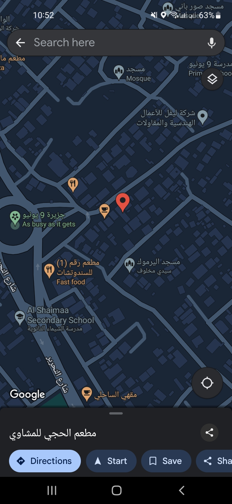

# Nearby Restaurants App

## Overview

The Nearby Restaurants App is a mobile application developed using Flutter. It displays a list of 10 nearby restaurants based on the user's current location. The app shows the restaurant's name, address, distance in kilometers from the user, rating, rating count, and an option to view the location on Google Maps.

This project is part of a job application for Speetar Health, showcasing the use of Flutter, Google Places API, and various other Flutter packages to create a feature-rich and responsive application.

## Features

- Displays a list of 10 nearby restaurants.
- Shows restaurant details: name, truncated address, distance, rating, and rating count.
- Displays restaurant's image if available.
- Indicates whether the restaurant is currently open.
- Provides a button to launch Google Maps with the restaurant's location.
- Implements a search functionality for nearby restaurants.

## Screenshots




## Getting Started

### Prerequisites

- Flutter SDK: [Install Flutter](https://flutter.dev/docs/get-started/install)
- Google API Key: [Get API Key](https://developers.google.com/maps/documentation/places/web-service/get-api-key)

### Installation

1. **Clone the repository:**

   ```bash
   git clone https://github.com/MoeAlm/nearby_restaurants_app.git
   cd nearby_restaurants_app
   flutter pub get
2. **Add the Google API Key**
- Open `lib/src/constants/constants.dart`.
- Replace the placeholder with your actual API key:

   ```dart
   const googleApiKey = 'YOUR_GOOGLE_API_KEY';

3. **Run the App**
- In Android Studio, ensure the emulator is running.
- Open the terminal and navigate to the project directory.
- Run the following command::

   ```bash
   flutter run
